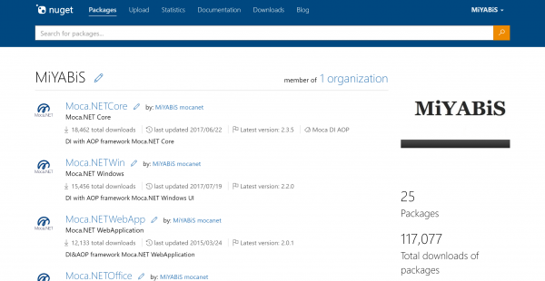
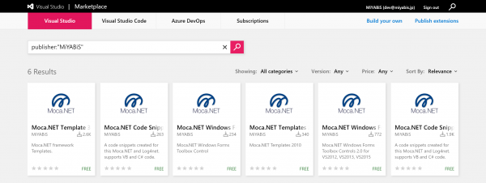
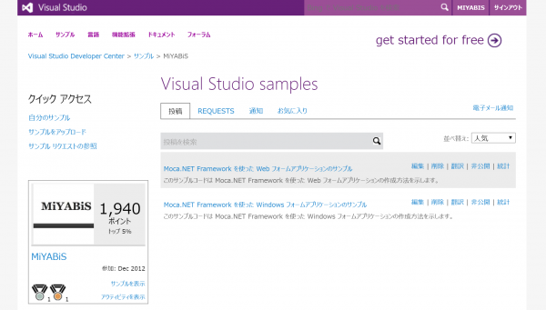

<a href="README.ja.html">Japanese</a>

## Overview
* Frameworks available for .NET development
* Support for multiple frameworks
* Utility methods and custom controls for Windows and Web
* Added to each project using NuGet
* Visual Studio extension for templates and snippets

<iframe data-lazyloaded="1" src="//docs.google.com/viewer?url=https%3A%2F%2Fraw.githubusercontent.com%2Fmocanet%2Fmocanet%2Fmaster%2Fdocs%2FMoca.pdf&amp;hl=ja&amp;embedded=true" data-src="//docs.google.com/viewer?url=https%3A%2F%2Fraw.githubusercontent.com%2Fmocanet%2Fmocanet%2Fmaster%2Fdocs%2FMoca.pdf&amp;hl=ja&amp;embedded=true" class="gde-frame litespeed-loaded" style="width:100%; height:600px; border: none;" scrolling="no" data-was-processed="true"></iframe>

## Link

### [GitHub | Moca.NET](https://github.com/mocanet)

 

### [NuGet Gallery | mocanet](https://www.nuget.org/profiles/mocanet)

 

### [Extensions for Visual Studio family of products | Visual Studio Marketplace](https://marketplace.visualstudio.com/search?term=publisher%3A%22MiYABiS%22&target=VS&category=All%20categories&vsVersion=&sortBy=Relevance)

 

### [Visual Studio code samples and examples in Moca.NET](https://code.msdn.microsoft.com/vstudio/site/search?f%5B0%5D.Type=Topic&f%5B0%5D.Value=Moca.NET&f%5B0%5D.Text=Moca.NET)

